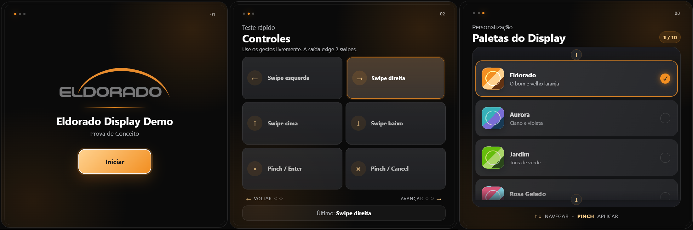

# Web app demonstração de interação com display

Este projeto é uma web app de demonstração voltada ao conceito de uso do Meta Ray-Ban Display, com foco em navegação por gestos, feedback visual e personalização da interface. A proposta é apresentar uma experiência de prova de conceito em que o usuário pode interagir com uma tela compacta de forma intuitiva, utilizando comandos simples como swipe e pinch.

## HOME

A tela HOME apresenta a identidade do Instituto Eldorado e funciona como ponto de entrada da demonstração. Nela, o usuário encontra a marca da aplicação e pode iniciar o fluxo de interação com um toque ou clique.

## CONTROLES

A tela CONTROLES permite testar os principais gestos da aplicação. O usuário pode experimentar:

- swipe para esquerda e direita;
- swipe para cima e para baixo;
- pinch / enter;
- pinch / cancel.

A interface também exibe um status visual do último comando realizado, reforçando a resposta da aplicação aos gestos.

## PALETAS DO DISPLAY

A tela de paletas mostra diferentes temas visuais que podem ser aplicados ao display. A navegação é feita de forma simples, com destaque para a opção selecionada e atualização imediata da aparência da interface.

## Links úteis

- Extensão Ray-Ban Display Sim. — https://chromewebstore.google.com/detail/meta-ray-ban-display-web/jpjlmmodokemlepklkdbimceggpbjcll
- Web App — https://gabrielrodrigues-eld.github.io/RB-Display-DemoELD/